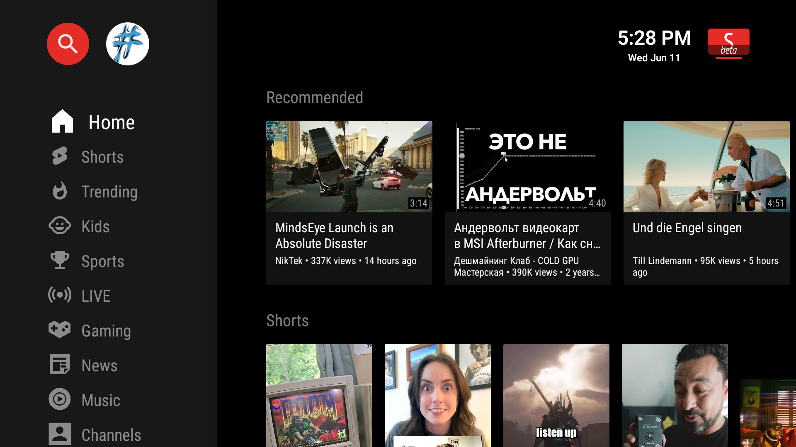
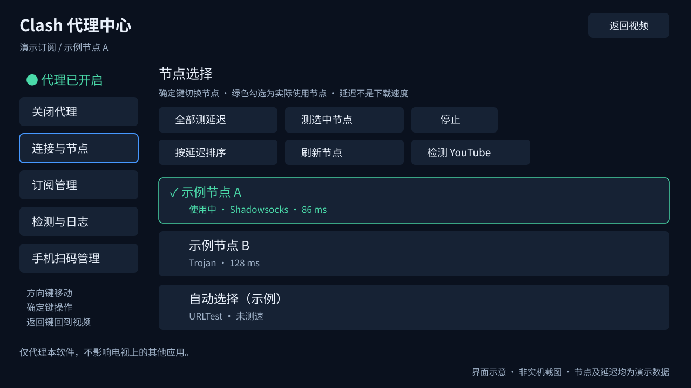
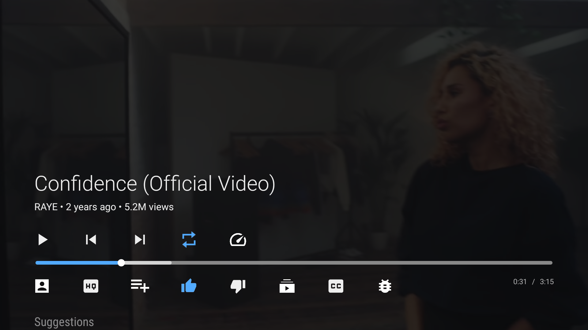

# 优兔喵视频 · SmartTube Clash Proxy

面向 Android TV 和电视盒子的 **SmartTube + Clash/Mihomo 扩展版**：保留大屏视频浏览与播放体验，把订阅、节点选择、延迟测试和手机扫码管理放进电视端。

[](https://github.com/qq294716498/SmartTube-ClashProxy/actions/workflows/proxy-build.yml)
[](#设备要求)
[上游来源与许可](THIRD_PARTY_NOTICES.md)

**[下载 APK · Releases](https://github.com/qq294716498/SmartTube-ClashProxy/releases)**

> 本项目是在 [SmartTube](https://github.com/yuliskov/SmartTube) 基础上的第三方修改版，代理能力来自 Clash 系的 [Mihomo](https://github.com/MetaCubeX/mihomo)，通过 [libmihomo-android](https://github.com/oviron/libmihomo-android) 接入。不是上述项目的官方发行版，也不隶属于 YouTube 或 Google。不提供视频源、订阅服务或内置节点。

## 界面预览

### 视频首页



上图为仓库保留的 **SmartTube 上游首页截图**，展示基础电视浏览界面；优兔喵视频的中文名称、品牌图标及首页代理入口与图中不同。

### Clash 代理中心



上图依据当前 `ProxySettingsPresenter` 的双栏布局、配色和按钮绘制，**是界面示意，不是实机截图**；节点名和延迟均为示例数据。实际界面提供连接与节点、订阅管理、检测与日志、手机扫码管理四个入口。

### 视频播放



上图同样来自仓库保留的上游截图。欢迎通过 PR 补充已隐藏订阅地址、二维码密钥及账号信息的本项目实机图，见[截图说明](docs/screenshots.md)。

## 主要功能

以下启动等待行为对应 Releases 中的 `v32.53-proxy.1-beta` 测试包；主分支代码尚未合入 PR #2。

- **电视浏览与播放**：首页、搜索、频道、订阅、历史记录及播放器，支持遥控器方向键操作。
- **内置代理**：应用内部 HTTP 代理，恢复上次使用的订阅及节点，无需手动填写本地端口。
- **首页启动等待**：开启内置代理时，首页等待本地订阅和节点恢复、旧连接清理、新的 YouTube 连通测速；通过后自动加载。
- **订阅管理**：添加、更新、切换和删除多个 Clash YAML 订阅；更新失败保留上次有效配置。
- **节点管理**：选择节点或订阅提供的自动组，全部测延迟、测试选中节点、停止测试、按延迟排序。
- **手机扫码管理**：在同一局域网通过手机浏览器输入订阅地址、管理订阅与节点。
- **故障诊断**：本地代理、YouTube 和视频域名检测，以及初始化诊断日志导出。

## 设备要求

| 项目 | 要求 |
| --- | --- |
| 系统 | Android 5.0 / API 21 及以上；主要面向 Android TV / 电视盒子 |
| 处理器 | `arm64-v8a` 或 `armeabi-v7a` |
| 输入 | 电视遥控器；手机可辅助输入订阅 |
| 网络 | 可用的网络连接；启用代理时需自行提供兼容的订阅及节点 |

当前代理版不提供可运行的 x86 / x86_64 安装包。16 KB 内存页设备的安装兼容性尚未验证；不能仅因核心支持就认定整个 APK 支持。

## 下载与安装

**[进入 Releases 下载](https://github.com/qq294716498/SmartTube-ClashProxy/releases)** · **[直接下载通用 APK](https://github.com/qq294716498/SmartTube-ClashProxy/releases/download/v32.53-proxy.1-beta/SmartTube_proxy_32.53_universal.apk)**

展开版本下方的 **Assets**，下载以 `.apk` 结尾的安装包。公开发布的附件无需登录 GitHub 即可下载，也不受 Actions 构建产物 7 天保留期限制。

- `SmartTube_proxy_32.53_universal.apk`：通用 ARM 安装包，同时支持 32 位和 64 位 ARM 电视/盒子，不确定架构时选它。
- `SHA256SUMS-universal.txt`：用于核对安装包的 SHA-256 校验值。
- `Source code (zip / tar.gz)`：源码压缩包，不能直接安装到电视。

将 APK 下载后通过 U 盘或局域网传到电视，用文件管理器打开安装；系统提示时允许该文件管理器安装应用。需要 Android 5.0 及以上，不支持 x86 / x86_64。

当前公开包标为 **Pre-release（测试版）**，包含首页等待订阅、节点恢复、连接清理和测速后自动加载的修复。节点不可用时显示设置入口，可切换节点。该包来自 PR #2 的已通过检查版本；完整修复尚未合并主分支，电视实机验证仍待完成。

安装包采用 `stproxyDebug` 调试签名，可能无法覆盖签名不同的旧版本；遇到冲突请先保留/备份订阅配置，不要直接卸载清除数据。不提供内置订阅或节点。

## 首次使用

1. 打开优兔喵视频，从首页顶部代理入口或设置进入 **Clash 代理中心**。
2. 进入 **订阅管理**，添加订阅名称及 HTTP / HTTPS 地址，完成更新。建议使用 HTTPS；订阅需返回兼容的 Clash YAML。
3. 选择要使用的订阅，开启内置代理，等待节点恢复和连通检测。
4. 在 **连接与节点** 中选择节点；必要时使用“测选中节点”或“全部测延迟”。
5. 返回首页，连通验证成功后会自动加载视频列表。

普通网页、单个分享链接和纯 Base64 节点列表不等同于 Clash YAML。订阅中的外部控制器、TUN、监听端口和分流规则不会原样启用：本项目采用应用内部全局代理，并限制本地监听。

### 手机扫码管理

电视与手机连接同一局域网，在代理中心选择 **手机扫码管理**，使用手机扫描二维码。管理页面可添加和更新订阅、选择订阅与节点。入口为临时局域网服务，带随机访问密钥，约 15 分钟到期；不要公开二维码、完整管理地址或订阅链接。

### 启动时如何连接

```text
打开 APP
  ├─ 内置代理关闭 → 首页按普通网络方式加载
  └─ 内置代理开启
       → 检查本地有效订阅
       → 启动核心、恢复订阅与节点
       → 清理旧 API / 媒体连接及核心连接
       → 当前 GLOBAL 出口进行新的 YouTube HTTPS 连通测速
       ├─ 通过 → 通知首页，自动加载
       └─ 失败 → 显示原因，可进入代理设置重试或换节点
```

启动检测只测试当前恢复的出口，不对所有节点做全量测速，也不把之前缓存的延迟当作本次成功。页面等待不会锁住菜单；等待超过 60 秒会提供设置入口，后台随后成功仍可自动恢复首页。离开首页或销毁页面后不抢焦点、不刷新其他分类。

**延迟测试不是下载速度测试**，也不能保证所有视频域名、地区内容和实际带宽都可用。没有有效订阅或当前节点不可用时，不会把代理伪装成已连接。

## 常见问题

**重新打开后首页空白或提示连接失败？** 先确认已安装包含启动等待修复的构建，然后在代理中心查看状态。确认订阅更新成功、节点可用；可用“检测与日志”重新连接或检查 YouTube 连通性。请记录构建提交和完整错误，避免只提供截断的异常。

**测速成功但播放卡顿？** 节点延迟、视频域名可达性和实际带宽是不同指标。尝试另一个节点，并执行视频域名检测。

**手机打不开管理页面？** 检查是否同一局域网、路由器是否隔离客户端，以及二维码是否过期；在电视重新打开手机管理入口。

**代理关闭后会怎样？** 本软件恢复直连；关闭代理不等于断网。

**会影响电视上的其他 APP 吗？** 不会作为系统 VPN 接管其他 APP。外部浏览器、系统登录页面等独立进程不在本软件代理覆盖范围内。

## 从源码构建

推荐使用仓库提供的 GitHub Actions，或 Linux / WSL 环境。基线工具链为 **JDK 17、Gradle 7.5、AGP 7.4.2、Android SDK 34、Build Tools 30.0.3、NDK 21.0.6113669**。SDK 路径通过环境变量或未提交的 `local.properties` 配置。

```bash
git clone --recurse-submodules https://github.com/qq294716498/SmartTube-ClashProxy.git
cd SmartTube-ClashProxy
git submodule update --init --recursive

# 下载固定版本核心，校验 SHA-256 并提取 ARM 原生库
bash scripts/fetch-libmihomo.sh
chmod +x gradlew

./gradlew lintStproxyDebug
./gradlew :smarttubetv:testStproxyDebugUnitTest --tests 'com.liskovsoft.smartyoutubetv2.tv.proxy.*'
./gradlew assembleStproxyDebug
```

输出目录：`smarttubetv/build/outputs/apk/stproxy/debug/`。原生依赖固定为 `libmihomo-android v0.3.3`（内含 `mihomo v1.19.30`）；下载脚本校验的 SHA-256 为：

```text
3bccc9020926b0b7bf1fd09553b41e4678c80cedc5cbe61d90a78fe4b71aca76
```

为兼容现有构建工具，代理版使用 Java 8 JNI 接口封装，并从上游 AAR 提取原生库。普通 SmartTube 构建风味不打包 Mihomo。自动检查包括 Lint、代理单元测试和 APK 构建；真实电视启动、遥控器交互和播放仍须实机验收。

## 项目结构

| 路径 | 内容 |
| --- | --- |
| `common/` | 浏览、播放器、共享代理路由及首页启动状态 |
| `smarttubetv/src/main/` | Android TV 页面及启动入口 |
| `smarttubetv/src/stproxy/` | Mihomo 核心、订阅、节点、代理中心及手机管理 |
| `smarttubetv/src/testStproxy/` | 代理配置、启动顺序和脱敏回归测试 |
| `MediaServiceCore/`、`SharedModules/` | 固定提交的上游子模块 |
| `scripts/fetch-libmihomo.sh` | 原生核心下载与校验 |
| `docs/` | 实现记录、验收说明及界面素材 |

## 上游来源、许可与致谢

| 来源 | 本项目使用方式 | 许可 |
| --- | --- | --- |
| [yuliskov/SmartTube](https://github.com/yuliskov/SmartTube/tree/c75606267ec948462818041879e3b7110fd918bc) | 32.53 基线：电视界面、浏览与播放器；在其上增加内置代理等功能 | MIT，保留原作者声明 |
| [MetaCubeX/mihomo](https://github.com/MetaCubeX/mihomo/tree/v1.19.30) | Clash 系代理核心 | GPL-3.0 |
| [oviron/libmihomo-android](https://github.com/oviron/libmihomo-android/tree/v0.3.3) | Android 原生库与 JNI 桥接，Java 兼容封装参考其接口 | GPL-3.0 |
| [MediaServiceCore](https://github.com/yuliskov/MediaServiceCore)、[SharedModules](https://github.com/yuliskov/SharedModules) | 上游媒体服务与共享模块 | 以各子模块许可证为准 |

根目录 [LICENSE](LICENSE) 保留 SmartTube 原有的 MIT 条款及版权声明，本次不变更仓库许可。**Mihomo 与 libmihomo-android 各自采用 GPL-3.0**，不能把根目录 MIT 条款当作替代这些组件许可证的授权。对应源码版本、原生依赖来源与各自许可链接见 [THIRD_PARTY_NOTICES.md](THIRD_PARTY_NOTICES.md)；分发包含这些组件的 APK 时需同时遵守适用的上游条款。

感谢 SmartTube、Mihomo/Clash 社区、libmihomo-android 及所有上游依赖的维护者。

## 反馈与贡献

欢迎通过 [Issues](https://github.com/qq294716498/SmartTube-ClashProxy/issues) 反馈，或提交 PR。问题报告请包含设备型号、Android 版本、APK 架构、构建提交、复现步骤和脱敏日志；不要提交订阅令牌、节点密码、私钥、二维码密钥或账号信息。新增代码请验证代理关闭、订阅缺失、测速失败和连续重启等情况。
